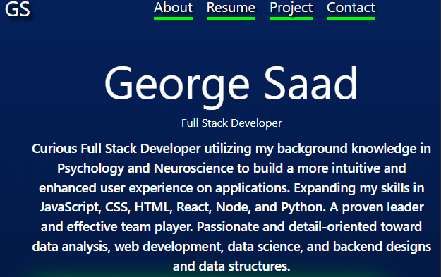

# George Saad React Portfolio

## Welcome to George Saad React Portfolio, an application created to assist you.

Welcome to George Saad's React Portfolio, showing his skillset in React, CSS, Javascript as well as some of his personality and who George is outside of work.

## Table of Contents

- [Usage](#usage)
- [Installation](#installation)
- [License](#license)
- [Contribution](#contribution)
- [Tests](#tests)
- [Questions](#questions)

## Usage

React Portfolio
https://gsaaad.github.io/react-resume/

- 

## Installation

npm install all dependencies

## License

[]

## Contribution

gsaaad

## Tests

jest

## Questions

If you have questions, email me @ : gsparqcode@gmail.com/ Github: [gsaaad](https://github.com/gsaaad)
